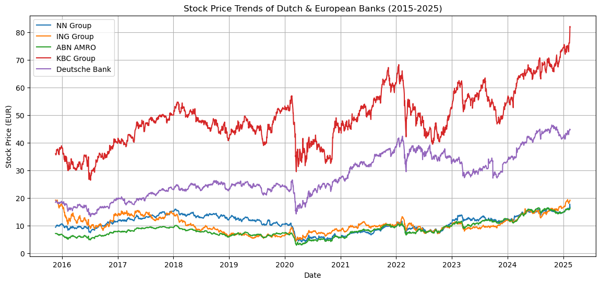
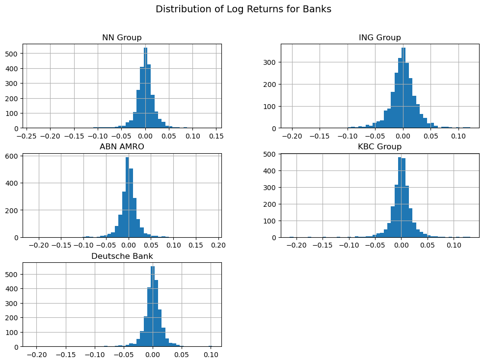
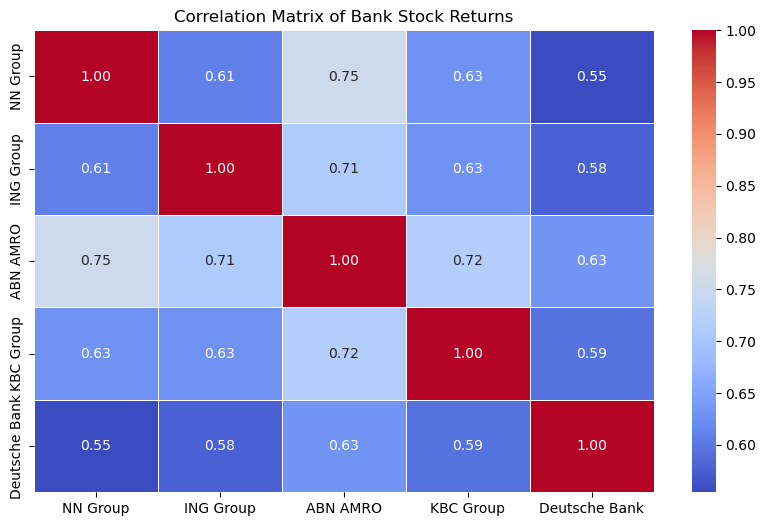
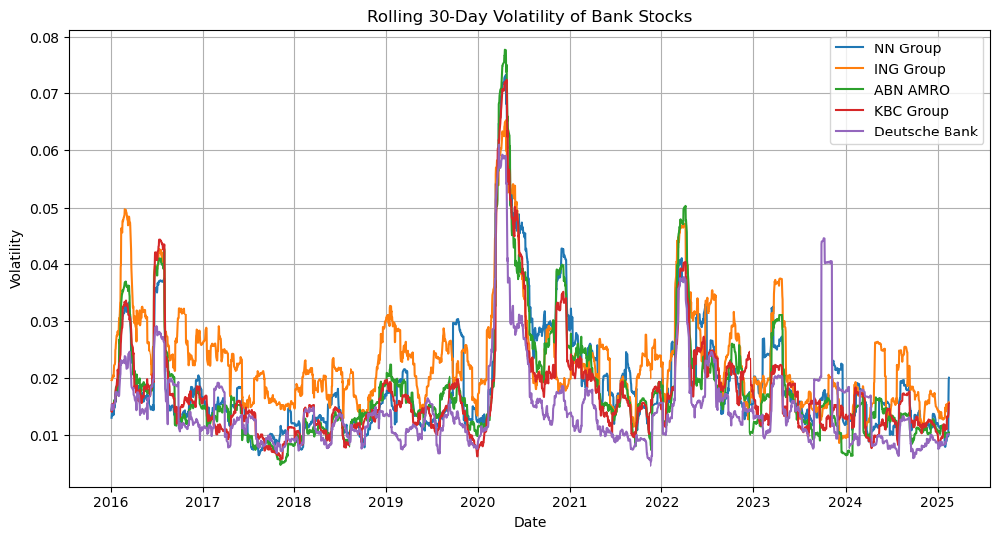
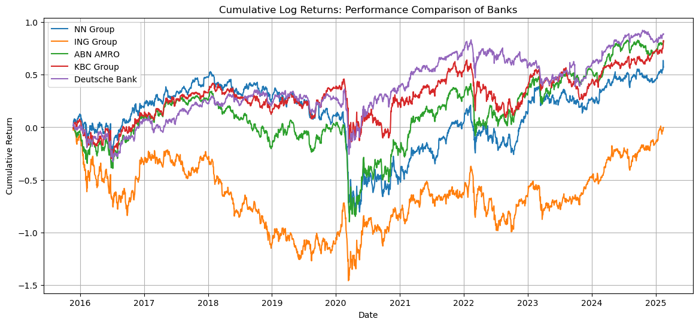
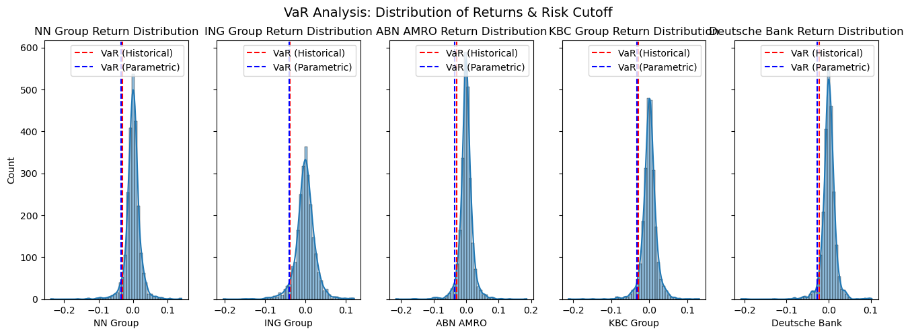
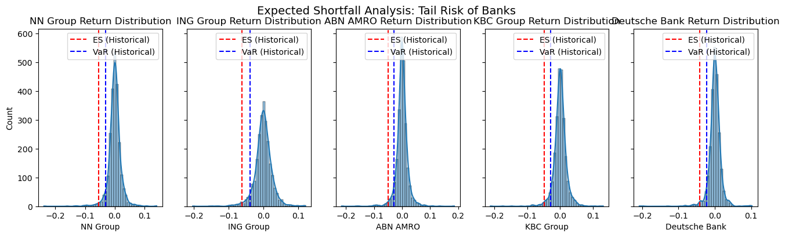
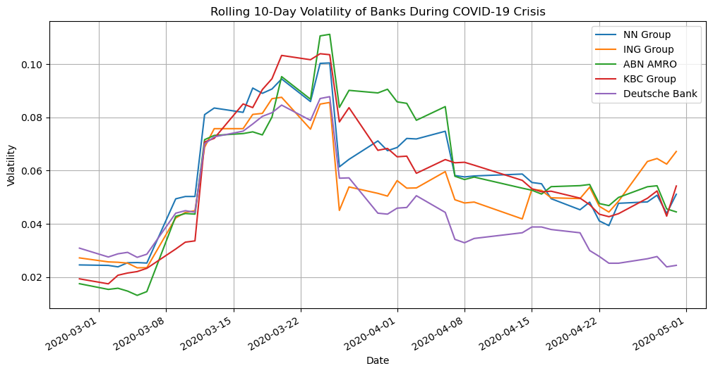
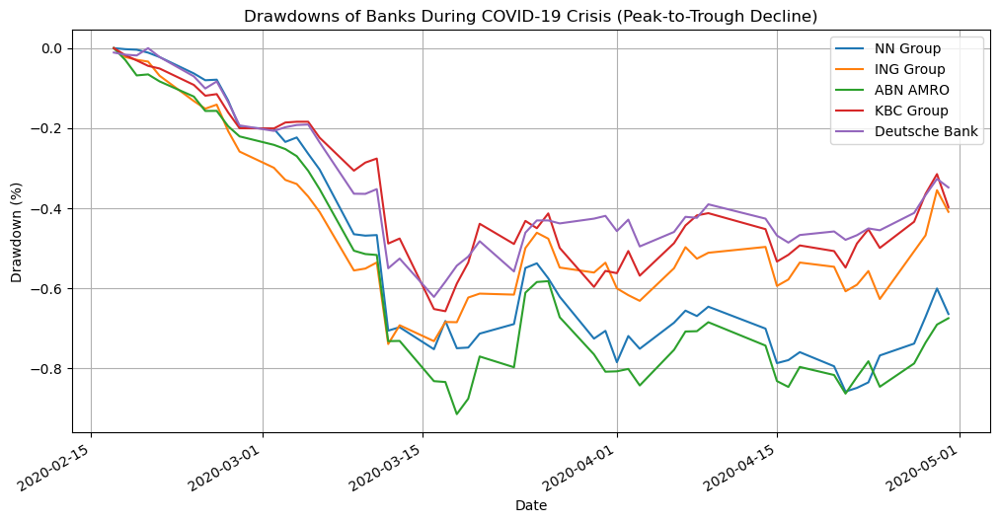

# 📊 Netherlands_Banking_Risk 🇳🇱🇧🇪🇩🇪  
🚀 **A Comprehensive Risk Analysis of Dutch & European Banks using Python**  

This project analyzes financial risk for major Dutch and European banks, focusing on **Value-at-Risk (VaR), Expected Shortfall (ES), Stress Testing (COVID-19), and Volatility Forecasting (GARCH)**.

---

## 🔍 **Project Overview**
This project examines the **market risk** of five European banks using **Yahoo Finance data**:  
✅ **NN Group (Netherlands)**  
✅ **ING Group (Netherlands)**  
✅ **ABN AMRO (Netherlands)**  
✅ **KBC Group (Belgium)**  
✅ **Deutsche Bank (Germany)**  

---

## 📂 **Project Structure**

---

## 1️⃣ **Data Collection & Cleaning**
📌 **[Notebook: Download & Clean Data](./download_clean_dataset.ipynb)**  
- ✅ Fetched stock price data from **Yahoo Finance**.  
- ✅ Cleaned missing values using **forward-fill and back-fill methods**.  
- ✅ Saved the **clean dataset** for further analysis.  

---

## 2️⃣ **Exploratory Data Analysis (EDA)**
📌 **[Notebook: EDA.ipynb](./EDA.ipynb)**  

### 🖼 **Stock Price Trends (2015-2025)**
📌 **Stock price movements of five banks over time.**  

**Findings:**  
✅ **KBC Group** has the highest stock value and volatility.  
✅ **Deutsche Bank** experienced major fluctuations but showed strong recovery.  
✅ **NN Group, ING Group, and ABN AMRO** have stable but lower stock prices.  
✅ **COVID-19 caused a major drop** in stock prices in 2020, with varied recovery rates.

---

### 🖼 **Distribution of Log Returns**
📌 **Visualizing return distributions to assess volatility & risk.**  

**Findings:**  
✅ Most return distributions are **close to normal** but exhibit **fat tails**.  
✅ **Deutsche Bank has the widest spread**, meaning **higher risk**.  
✅ **ABN AMRO & ING Group** are more **concentrated**, suggesting **lower volatility**.

---

### 🖼 **Correlation Matrix of Bank Stock Returns**
📌 **How similar are the banks' price movements?**  

**Findings:**  
✅ **NN Group & ABN AMRO** are highly correlated (0.75), meaning they react similarly to market changes.  
✅ **Deutsche Bank is the least correlated**, offering **diversification benefits**.  
✅ **Dutch banks (NN, ING, ABN AMRO) are strongly correlated**, meaning similar economic influences.

---

### 🖼 **Rolling 30-Day Volatility of Bank Stocks**
📌 **Measuring risk levels over time for each bank.**  

**Findings:**  
✅ **Volatility spiked massively during the COVID-19 crisis (2020)**.  
✅ **ING Group shows the highest volatility throughout** the analyzed period.  
✅ **Deutsche Bank has the lowest volatility**, making it a safer investment.  
✅ **Volatility tends to mean-revert but remains elevated after 2020.**

---

### 🖼 **Cumulative Log Returns: Performance of Banks**
📌 **Comparing long-term cumulative returns of each bank.**  

**Findings:**  
✅ **Deutsche Bank shows the highest long-term growth**.  
✅ **KBC Group and ABN AMRO exhibit strong performance** but lower than Deutsche Bank.  
✅ **ING Group underperforms significantly**, struggling to recover.  
✅ **The 2020 market crash had a major impact on all banks, with varied recovery rates.** 

---
## 3️⃣ **Risk Analysis: Value-at-Risk (VaR)**
📌 **[Notebook: Risk_Analysis.ipynb](./Risk_Analysis.ipynb) – VaR Section**  

### 🖼 **Value-at-Risk (VaR) Distribution**
📌 **Historical, Parametric, and Monte Carlo VaR calculations.**  

| Bank         | Historical VaR | Parametric VaR | Monte Carlo VaR |
|-------------|---------------|---------------|-----------------|
| NN Group    | -3.04%        | -3.52%        | -3.56%         |
| ING Group   | -3.87%        | -4.09%        | -4.06%         |
| ABN AMRO    | -2.87%        | -3.39%        | -3.39%         |
| KBC Group   | -2.80%        | -3.23%        | -3.18%         |
| Deutsche Bank | -2.23%       | -2.71%        | -2.68%         |

**Findings:**  
✅ **ING Group has the highest risk** (largest potential loss).  
✅ **Deutsche Bank has the lowest VaR**, meaning **lower risk exposure**.  
✅ **Monte Carlo and Parametric VaR** closely match, validating normality assumptions.

---

## 4️⃣ **Expected Shortfall (ES) – Tail Risk**
📌 **[Notebook: Risk_Analysis.ipynb](./Risk_Analysis.ipynb) – ES Section**  

### 🖼 **Expected Shortfall (ES) Distribution**
📌 **Analyzing worst-case scenario losses.**  

| Bank         | Historical ES | Parametric ES | Monte Carlo ES |
|-------------|--------------|--------------|----------------|
| NN Group    | -5.38%       | -4.41%       | -4.22%        |
| ING Group   | -6.11%       | -5.13%       | -4.22%        |
| ABN AMRO    | -5.04%       | -4.26%       | -4.22%        |
| KBC Group   | -4.83%       | -4.05%       | -4.22%        |
| Deutsche Bank | -4.10%      | -3.40%       | -4.22%        |

✅ **ING Group has the highest expected shortfall**, indicating the worst potential losses.  
✅ **Deutsche Bank remains the least risky bank in extreme scenarios.**  

---

## 5️⃣ **Stress Testing: COVID-19 Market Impact**
📌 **[Notebook: Risk_Analysis.ipynb](./Risk_Analysis.ipynb) – Stress Testing Section**  

### 🖼 **Stock Prices During Crisis**
.png)

### 🖼 **Volatility Spikes During Crisis**

### 🖼 **Drawdown Analysis**

✅ **ABN AMRO suffered the worst drawdown (-91.4%)**.  
✅ **Deutsche Bank had the lowest drawdown (-62.1%)**, showing resilience.  
✅ **Volatility spikes were highest during March 2020**, peaking at **11.12% for ABN AMRO**.

---

## 6️⃣ **Volatility Forecasting using GARCH(1,1)**
📌 **[Notebook: GARCH(1,1).ipynb](./GARCH(1,1).ipynb)**  

### 🖼 **30-Day Volatility Forecast**
.png)

✅ **NN Group’s volatility is expected to decline.**  
✅ **ING Group & KBC Group show increasing risk.**  
✅ **ABN AMRO & Deutsche Bank remain the least volatile.**  

---

## 🛠 **Technologies Used**
- **Python**: Pandas, Statsmodels, Matplotlib, Seaborn  
- **Risk Modeling**: VaR, Expected Shortfall, Monte Carlo Simulations  
- **Time Series Forecasting**: GARCH Model  
- **Data Visualization**: Matplotlib & Seaborn  

---

## 📬 **Contact & Connect**
📩 [Email Me](mailto:manoskonstantinos960@gmail.com)  
🔗 [LinkedIn](https://www.linkedin.com/in/konstantinosmanos)  
🖥 [GitHub](https://github.com/konstantinosmanos)  

🚀 **Like this project? Give it a ⭐ on GitHub!**

